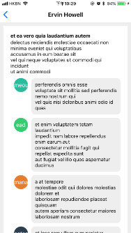

# SCAPP

This repository include a simple social network app source code which is written by [React Native](https://facebook.github.io/react-native/).

It currently supports iOS only.




## Getting Started
- Clone this repository.
- Install node dependencies.
```bash
npm install
```
- Install React Native CLI
```bash
npm install -g react-native-cli
```
- Start in iOS emulator
```bash
react-native run-ios
```

## Run in Xcode
- go to /ios
- open SCAPP.xcworkspace by Xcode